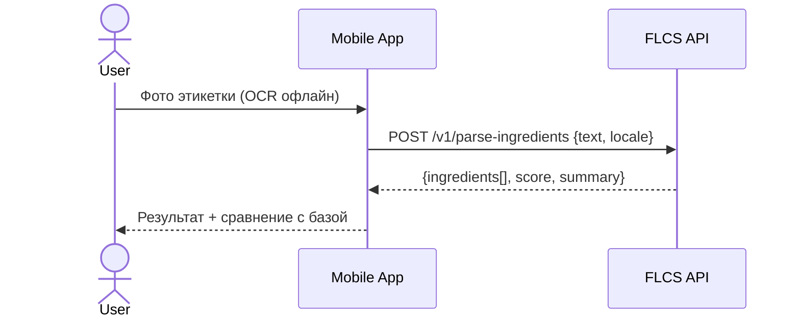

# Architecture Toolkit — Structurizr + Mermaid + Kroki

Ниже — готовые **шаблоны и скрипты** для визуализации архитектуры нашего приложения **Food Label & Calorie Scan (FLCS)**. Всё — под копипасту в репозиторий.

## Структура каталога

```
docs/architecture/
  c4/workspace.dsl            # Structurizr DSL: Context/Container/Component
  er.mmd                      # Mermaid ER-диаграмма БД
  flows/barcode-seq.mmd       # Mermaid: скан штрихкода (sequence)
  flows/ocr-seq.mmd           # Mermaid: OCR-этикетка (sequence)
  scripts/gen-diagrams.sh     # Рендер PNG/SVG через Kroki API
  .github/workflows/diagrams.yml  # CI: авто-рендер и артефакты
```

---

## 1) Structurizr DSL (C4-модель)

**Файл:** `docs/architecture/c4/workspace.dsl`

```dsl
workspace "FLCS Architecture" "C4 views for Food Label & Calorie Scan" {

    model {
        person user "Пользователь" "Сканирует этикетки и ведёт дневник"

        softwareSystem flcs "FLCS (Mobile + API)" "Скан состава + дневник калорий" {
            container mobile "Мобильное приложение (RN/Expo)" "React Native, Expo" "UI, камера, офлайн OCR, локальный кеш"
            container api "Edge API" "Serverless (Vercel/Cloudflare/Supabase)" "Парсинг ингредиентов, прокси к OFF, аутентификация"
            container db  "База данных" "Postgres (Supabase)" "foods, entries, ingredients, …"
            container queue "Очередь задач (опц.)" "Worker/Queue" "фоновая нормализация, кеширование"
        }

        softwareSystem off "Open Food Facts" "Публичное API штрих‑кодов"
        softwareSystem fdc "USDA FDC" "Каталог продуктов (без штрих‑кода)"
        softwareSystem openrouter "OpenRouter AI" "LLM-прокси для классификации ингредиентов"

        user -> mobile "Сканирует, просматривает, добавляет записи"
        mobile -> api "REST/HTTPS запросы"
        api -> db "CRUD, кеш и журналирование"
        api -> off "GET /product/{barcode}"
        api -> fdc "Поиск общих блюд (опц.)"
        api -> openrouter "POST /chat (strict JSON)"
        api -> queue "Постановка фона (опц.)"
    }

    views {
        systemContext flcs "c1-context" {
            include *
            autolayout lr
        }

        container flcs "c2-containers" {
            include *
            autolayout lr
        }

        component api "c3-api-components" {
            component rest "REST Layer" "Endpoints v1 (parse-ingredients, off-proxy, foods-search, diary)"
            component normalizer "Normalizers" "Очистка текста, сопоставление E‑кодов/аллергенов"
            component cache "Cache" "Кеш продуктов/ответов (Redis/pg)"
            component ai "AI Proxy" "Интеграция с OpenRouter (response_format=json_object)"
            component auth "Auth" "Сессии/ключи/API-токены"
            api -> rest "экспонирует"
            rest -> normalizer "использует"
            rest -> ai "вызывает"
            rest -> cache "читает/пишет"
            rest -> auth "проверяет"
            rest -> db "читает/пишет"
            autolayout lr
        }

        styles {
            element "Software System" { background #0ea5e9 color #ffffff }
            element "Container" { background #22c55e color #ffffff }
            element "Component" { background #a78bfa color #ffffff }
            element "Person" { background #f59e0b color #ffffff }
            relationship { routing Orthogonal }
        }
    }
}
```

> Откройте `.dsl` в Structurizr Lite/Cloud — получите интерактивные C4‑диаграммы.

---

## 2) ER‑диаграмма БД (Mermaid)

**Файл:** `docs/architecture/er.mmd`

```mermaid
erDiagram
  USERS_PROFILE ||--o{ ENTRIES : makes
  FOODS ||--o{ ENTRIES : used_in
  FOODS ||--o{ FOOD_SOURCES : sourced_from
  INGREDIENTS ||--o{ FOOD_INGREDIENTS : part_of
  FOODS ||--o{ FOOD_INGREDIENTS : has
  USERS_PROFILE ||--o{ RECIPES : owns
  RECIPES ||--o{ RECIPE_ITEMS : contains

  USERS_PROFILE {
    uuid user_id PK
    int age
    decimal weight_kg
    decimal height_cm
    text goal
    int target_kcal
  }
  FOODS {
    uuid id PK
    text name
    text brand
    text barcode
    int kcal_100
    decimal p_100
    decimal f_100
    decimal c_100
    text image_url
  }
  FOOD_SOURCES {
    uuid id PK
    uuid food_id FK
    text source     // OFF, OCR, FDC
    text source_id
    timestamptz last_checked_at
  }
  INGREDIENTS {
    uuid id PK
    text name
    text e_code
    bool is_allergen
  }
  FOOD_INGREDIENTS {
    uuid food_id FK
    uuid ingredient_id FK
    decimal grams_per_100g
  }
  ENTRIES {
    uuid id PK
    uuid user_id FK
    date dt
    text meal_slot   // breakfast/lunch/dinner/snack
    uuid food_id FK
    decimal portion_g
    int kcal
    decimal p
    decimal f
    decimal c
  }
  RECIPES { uuid id PK, uuid user_id FK, text name }
  RECIPE_ITEMS { uuid id PK, uuid recipe_id FK, uuid food_id FK, decimal grams }
```

---

## 3) Последовательности (Mermaid Sequence)

**Файл:** `docs/architecture/flows/barcode-seq.mmd`

```mermaid
sequenceDiagram
  actor User
  participant App as Mobile App
  participant OFF as Open Food Facts
  participant API as FLCS API
  participant DB as Postgres

  User->>App: Навести камеру на штрих-код
  App->>OFF: GET /product/{barcode}
  OFF-->>App: product JSON
  App->>API: POST /v1/parse-ingredients (если нужен разбор)
  API-->>App: {ingredients, score, summary}
  App->>DB: (опц.) save scan_event/food cache
  App-->>User: Карточка + Health Score + «Добавить в дневник»
```

**Файл:** `docs/architecture/flows/ocr-seq.mmd`



---

## 4) Рендер через Kroki (PNG/SVG)

**Файл:** `docs/architecture/scripts/gen-diagrams.sh`

```bash
#!/usr/bin/env bash
set -euo pipefail
ROOT=$(cd "$(dirname "$0")/.." && pwd)
OUT="$ROOT/_rendered"
mkdir -p "$OUT"

render() {
  local type="$1"; shift
  local src="$1"; shift
  local base=$(basename "$src")
  local name="${base%.*}"
  # PNG
  curl -fsSL -H "Content-Type: text/plain" \
    --data-binary @"$src" \
    "https://kroki.io/${type}/png" > "$OUT/${name}.png"
  # SVG
  curl -fsSL -H "Content-Type: text/plain" \
    --data-binary @"$src" \
    "https://kroki.io/${type}/svg" > "$OUT/${name}.svg"
  echo "Rendered $src → $OUT/${name}.{png,svg}"
}

# ER
render mermaid "$ROOT/er.mmd"
# Flows
render mermaid "$ROOT/flows/barcode-seq.mmd"
render mermaid "$ROOT/flows/ocr-seq.mmd"

# Примечание: C4 (Structurizr) рендерьте в Structurizr (Lite/Cloud) → экспортируйте PNG/SVG.
```

> Сделайте файл исполняемым: `chmod +x docs/architecture/scripts/gen-diagrams.sh`.

### (Опционально) Self‑hosted Kroki (docker-compose)

```yaml
version: '3.8'
services:
  kroki:
    image: yuzutech/kroki
    ports: ["8000:8000"]
```

И тогда меняем URL на `http://localhost:8000`.

---

## 5) CI: GitHub Actions — авто-рендер

**Файл:** `.github/workflows/diagrams.yml`

```yaml
name: Render Architecture Diagrams
on:
  push:
    paths:
      - 'docs/architecture/**.mmd'
      - 'docs/architecture/scripts/**.sh'
  workflow_dispatch: {}

jobs:
  render:
    runs-on: ubuntu-latest
    steps:
      - uses: actions/checkout@v4
      - name: Make scripts executable
        run: chmod +x docs/architecture/scripts/gen-diagrams.sh
      - name: Render via Kroki
        run: docs/architecture/scripts/gen-diagrams.sh
      - name: Upload artifacts
        uses: actions/upload-artifact@v4
        with:
          name: diagrams
          path: docs/architecture/_rendered
```

---

## 6) (Опционально) Miro API — создать фигуру программно

Добавьте токен `MIRO_TOKEN` (user or team), ID board’а `MIRO_BOARD_ID`.

```bash
curl -X POST \
  -H "Authorization: Bearer $MIRO_TOKEN" \
  -H "Content-Type: application/json" \
  https://api.miro.com/v2/boards/$MIRO_BOARD_ID/shapes \
  -d '{
    "data": {"content": "FLCS Context"},
    "style": {"fillColor": "green"},
    "position": {"x": 0, "y": 0}
  }'
```

---

## 7) ADR — шаблон архитектурного решения

**Файл:** `docs/architecture/adr/0001-use-react-native.md`

```md
# ADR-0001: Используем React Native + Expo
## Контекст
Нужны iOS/Android, камера и быстрый MVP.
## Решение
React Native (Expo) + VisionCamera + serverless API.
## Последствия
+ Быстрые релизы, общий код UI
- Нужны EAS-билды для нативных модулей
```

---

## 8) Как пользоваться

1. Скопируйте файлы из этого документа в репозиторий по указанным путям.
2. Откройте `c4/workspace.dsl` в Structurizr (Lite/Cloud) → проверьте связи, экспортируйте PNG/SVG.
3. Запустите `docs/architecture/scripts/gen-diagrams.sh` → получайте ER/Sequence в `/_rendered`.
4. Включите CI (`diagrams.yml`), чтобы артефакты генерировались автоматически при каждом изменении диаграмм.
5. Храните ключевые решения в папке `adr/` (по одному файлу на решение).

Готово! Могу дополнить C4‑модель разрезом **Deployment** (с окружениями dev/stage/prod) и ER‑схему — индексами/ограничениями.

